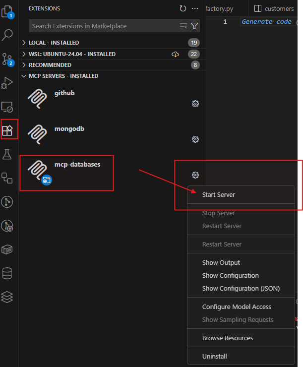
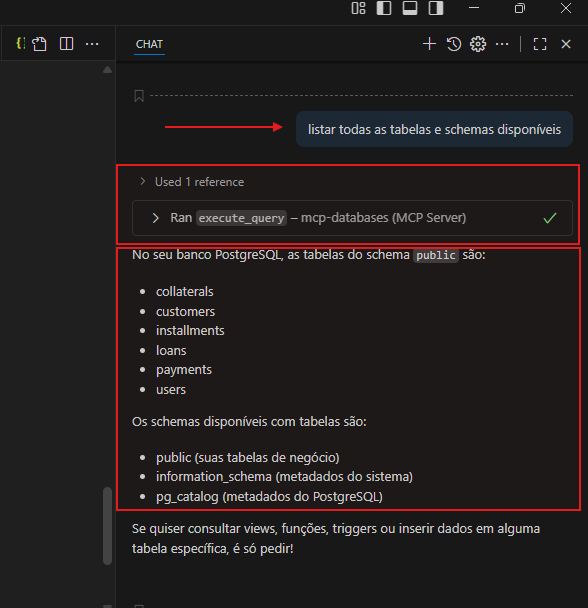
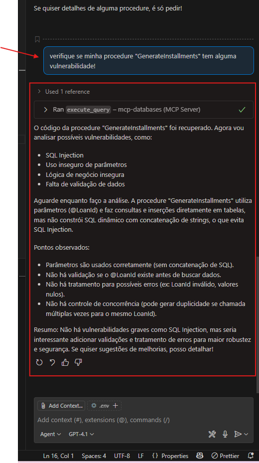

# MCP Databases Server

Este projeto implementa um servidor MCP (Model Context Protocol) em Python para expor operações de banco de dados relacionais (SQL Server, MySQL, PostgreSQL) como ferramentas MCP, permitindo que aplicações LLM e agentes consultem e manipulem dados de forma segura e eficiente.

## O que este MCP Server faz?
- Expõe operações de banco de dados como ferramentas MCP (tools) para uso por LLMs, agentes e automações.
- Permite executar queries, inserir registros, listar tabelas e expor o schema de bancos SQL Server, MySQL e PostgreSQL.
- Utiliza variáveis de ambiente para configuração segura de credenciais.
- Suporta integração com o VS Code e Claude via arquivo `mcp.json`.

## Tools disponíveis
- **execute_query**: Executa uma query SQL no banco de dados especificado.
- **insert_record**: Insere um registro em uma tabela do banco de dados especificado.
- **list_tables**: Lista todas as tabelas do banco de dados especificado.
- **expose_schema**: Expõe o schema do banco de dados especificado.


## Instalação local e global (Linux)

### Instalação local (ambiente virtual)

### Na raiz do projeto crie uma pasta `.mcpenv`

1. Crie e ative o ambiente virtual:
  ```sh
  python3 -m venv .mcpenv
  source .mcpenv/bin/activate
  ```
2. Instale as dependências:
  ```sh
  pip install -r requirements.txt
  pip install .
  ```

### Crie uma pasta na raiz do projeto .vscode
## Gerando o arquivo mcp.json
No diretório do projeto, crie um arquivo `.vscode`/`mcp.json` com o seguinte conteúdo:
```json
{
  "servers": {
    "mcp-databases": {
      "type": "stdio",
      "command": ".mcpenv/bin/python",
      "args": ["server.py"]
    }
  }
}
```
3. O comando `mcp-databases` estará disponível no terminal enquanto o ambiente estiver ativado.


### Instalação global (pipx)
1. Instale o pipx (se necessário):
  ```sh
  sudo apt update
  sudo apt install pipx
  pipx ensurepath
  ```
2. Instale o MCP globalmente:
  ```sh
  pipx install /caminho/para/seu/projeto
  pipx inject mcp-databases python-dotenv
  ```
3. O comando `mcp-databases` ficará disponível em qualquer terminal do sistema.

### Crie uma pasta na raiz do projeto .vscode isso instala o mcp nas extensoes do vscode
## Gerando o arquivo mcp.json
No diretório do projeto, crie um arquivo `.vscode`/`mcp.json` com o seguinte conteúdo:
```json
{
  "servers": {
    "mcp-databases": {
      "transport": "stdio",
      "command": "/home/%USER%/.local/bin/mcp-databases",
      "tools": [
        "list_tables",
        "execute_query",
        "insert_record",
        "expose_schema",
        "safe_query_prompt"
      ]
    }
  }
}
```

### Atualização global
Se atualizar o código, reinstale com:
```sh
pipx reinstall mcp-databases
```

## Dependências
- Python 3.10+
- [MCP Python SDK >=1.2.0](https://github.com/modelcontextprotocol/python-sdk)
- [pyodbc](https://pypi.org/project/pyodbc/) (SQL Server)
- [pymysql](https://pypi.org/project/pymysql/) (MySQL)
- [psycopg2-binary](https://pypi.org/project/psycopg2-binary/) (PostgreSQL)
- Drivers ODBC:
  - SQL Server: `msodbcsql18` (Linux: `sudo apt-get install msodbcsql18`)
  - MySQL: `libmysqlclient-dev` (Linux: `sudo apt-get install libmysqlclient-dev`)
  - PostgreSQL: `libpq-dev` (Linux: `sudo apt-get install libpq-dev`)
- python-dotenv (opcional, para carregar variáveis de ambiente de um arquivo `.env`)

Instale as dependências Python com:
```sh
pip install -r requirements.txt
```
- Em caso que de erro de modulo nao encontrado ao executar globalmente.
Instale as dependências Python com `pipx inject {comando} {dependeencia}`:
### ex:
```sh
pipx inject mcp-databases mysql-connector-python
```

## Configuração de ambiente
Defina as variáveis de ambiente para o banco desejado. Exemplo para PostgreSQL:
```env
DB_TYPE=postgres
POSTGRES_HOST=127.0.0.1
POSTGRES_PORT=5432
POSTGRES_USER=admin
POSTGRES_PASSWORD=wlg48cd8
POSTGRES_DB=loan_pgsql
```
Global (pipx):
```sh
mcp-databases
```
---

## Rodar o mcp server através do menu de extensões -> MCP SERVERS



---
## Usando o chat do GitHub Copilot para listar tabelas



---
## Usando o chat do GitHub Copilot para analisar procedure



Para dúvidas ou contribuições, consulte a documentação oficial do [Model Context Protocol](https://modelcontextprotocol.io/) ou abra uma issue neste repositório.
